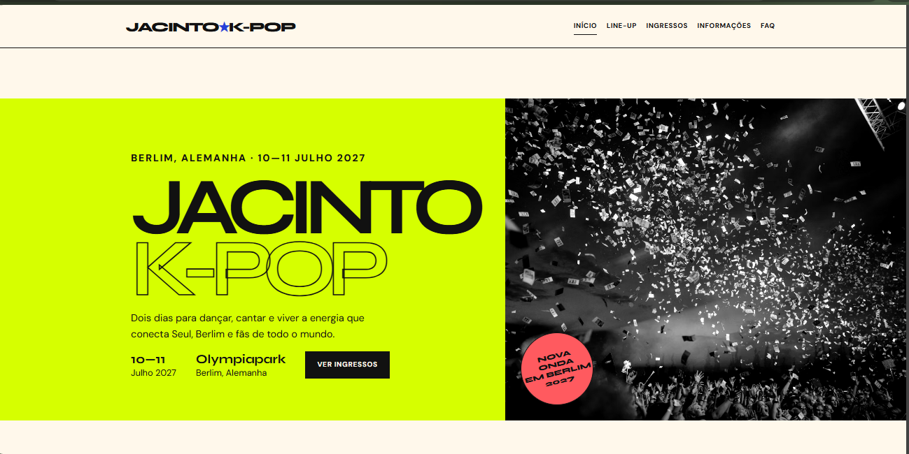
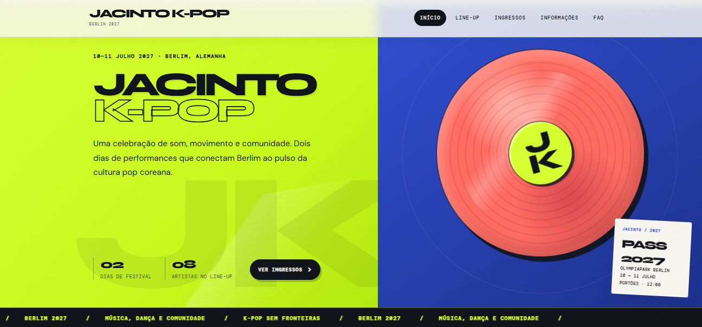

# Jacinto K-Pop

**Alunos:** Rafael Rc, Henrique e Gabriel Freires  
**Site publicado:** https://trabalho-kpop.vercel.app

## Briefing

Festival fictício de K-pop realizado nos dias 10 e 11 de julho de 2027, no Olympiapark Berlin, em Berlim, Alemanha.

**Público:** jovens e adultos entre 14 e 30 anos, fãs de K-pop, dança, moda e cultura pop coreana.

**Clima:** elétrico, urbano, coletivo.

### Paleta
- `#11110F` — textos, linhas e rodapé
- `#F8F4EC` — fundo principal
- `#D8FF2E` — energia e destaque
- `#3155D9` — contraste e informação
- `#FF665F` — chamadas e contato

### Fontes
- **Syne:** títulos fortes e visuais, inspirados em cartazes de festival.
- **DM Sans:** textos claros e fáceis de ler em computador e celular.

### Inspirações visuais

1. [Lollapalooza Berlin](https://www.lollapaloozade.com/en) — gostamos de como o site organiza as informações do festival, os ingressos e o local em Berlim.
2. [KCON USA](https://kconusa.com/artist-lineup/) — gostamos do destaque dado aos artistas, que inspirou a organização do nosso line-up de K-pop.
3. [Coachella](https://coachella.com/) — gostamos da comunicação visual marcante e da forma como o festival apresenta sua identidade.
## Antes e depois

### Antes


### Depois


## Os 4 prompts que mais fizeram diferença

1. Crie um site de festival de K-pop chamado Jacinto K-Pop, em Berlim, com visual editorial e minimalista.
2. Use as cores #11110F, #F8F4EC, #D8FF2E, #3155D9 e #FF665F. Não use gradientes, emojis ou cards genéricos.
3. Crie cinco páginas com menu funcional: início, line-up, ingressos, informações e FAQ.
4. Adicione animações pequenas e acessíveis, respeitando usuários que preferem reduzir movimento.

## Estrutura

```text
jacinto-kpop-caprichado/
├── img/
│   └── COLOQUE-AS-IMAGENS-AQUI.txt
├── index.html
├── lineup.html
├── ingressos.html
├── informacoes.html
├── faq.html
├── style.css
├── script.js
└── README.md
```

## Como abrir

Abra a pasta no VS Code e execute `index.html` com a extensão Live Server ou diretamente no navegador.
